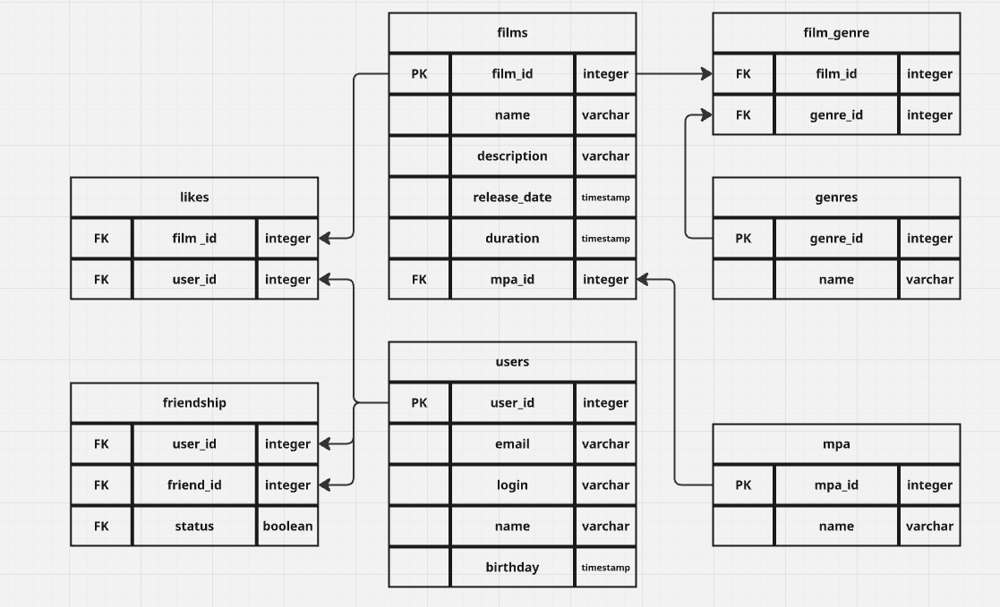

# java-filmorate
Template repository for Filmorate project.

- Получение всех фильмов
```sql
SELECT name
FROM films
```

- Получение топ N наиболее популярных фильмов
```sql
SELECT f.film_id,
f.name,
COUNT(l.user_id)
FROM films AS f
LEFT JOIN likes AS l ON f.film_id = l.film_id
GROUP BY f.film_id, f.name
ORDER BY COUNT(l.user_id) DESC
LIMIT N;
```

- Получение списка общих друзей с другим пользователем
```sql
SELECT u.user_id,
u.user_login
FROM user AS u
JOIN friendship AS f1 ON u.user_id = f1.friend_id AND f1.user_id = 1 AND f1.status = 'CONFIRMED'
JOIN friendship AS f2 ON u.user_id = f2.friend_id AND f2.user_id = 2 AND f2.status = 'CONFIRMED';
```
